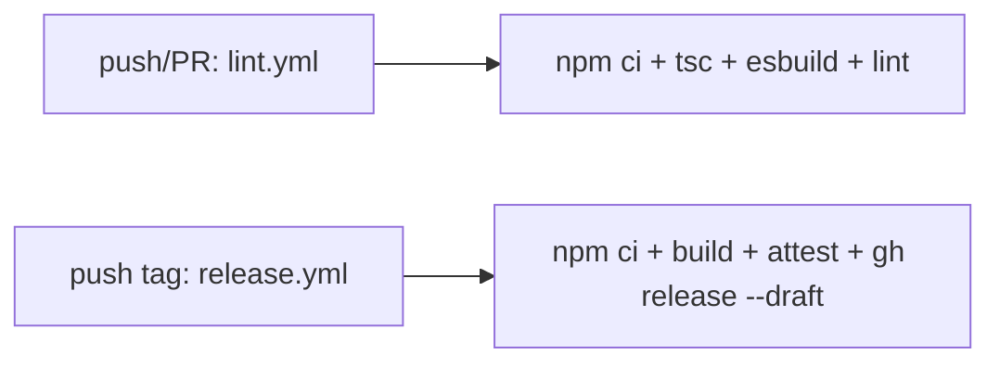

# ob-ps 插件开发工作流

**触发:** 用户说"给插件加功能" / "修复 lint" / "构建发布" / "添加设置项" / "改视图"/ 或任何涉及 ob-ps 项目源码的操作

## 项目结构

```
ob-ps/
├── main.ts                 # 插件入口:Plugin 子类 + 设置标签页
├── manifest.json           # Obsidian 插件清单
├── styles.css              # UI 样式
├── esbuild.config.mjs      # 构建配置(输出策略:生产→根目录,开发→同步 vault)
├── tsconfig.json           # TypeScript 配置(moduleResolution: bundler)
├── eslint.config.mts       # ESLint + obsidianmd 推荐规则
└── src/
    ├── runner.ts           # 进程管理(createTab/spawn/stop + ANSI 清理)
    └── view.ts             # ItemView 子类(内联表单 + 进程列表 + 确认弹窗)
```

## 构建流程

有三种运行模式:

```bash
# 1. 开发监听:esbuild watch + 同步到 vault ../123
npm run dev          # → node esbuild.config.mjs

# 2. 生产构建:tsc 类型检查 + esbuild --production,输出到项目根 main.js
npm run build        # → tsc -noEmit && node esbuild.config.mjs --production

# 3. 仅 lint
npm run lint         # → eslint .
```

### esbuild 输出策略

- **生产/CI 模式**(`--production`):只写 `main.js` 到项目根目录,供 `release.yml` 上传为 release assets
- **开发模式**(无 `--production`):写 `main.js` + 同步到 `../123/.obsidian/plugins/local-runner/`(manifest、styles 一并同步)
- 可通过环境变量 `LOCAL_RUNNER_VAULT` 覆盖同步目标路径

## 源文件职责

### `main.ts` — 插件入口

`Plugin` 子类 + `PluginSettingTab` 设置标签页。

关键模式:

```ts
export const DEFAULT_SETTINGS: PluginSettings = { ... };

interface PluginData {
  processes: ProcessConfig[];
  settings?: PluginSettings;
}

// onload 时:
const data = (await this.loadData()) as PluginData | null;
this.settings = Object.assign({}, DEFAULT_SETTINGS, data?.settings);

// 保存时:
await this.saveData({ processes: this.savedConfigs, settings: this.settings });
```

设置标签页使用 `Setting` API:

```ts
// ✅ 正确:heading 不应包含插件名
new Setting(containerEl).setName("设置").setHeading();

// ✅ 正确:sentence case
.setName("删除前确认")

// ✅ 正确:slider 无需 setDynamicTooltip(新版默认内联)
.setLimits(10_000, 500_000, 10_000)
```

打开设置页(私有 API,需类型桥接):

```ts
interface AppWithSetting {
  setting: { open(): Promise<void>; openTabById(id: string): void };
}
const app = this.app as unknown as AppWithSetting;
await app.setting.open();
app.setting.openTabById(this.manifest.id);
```

### `src/runner.ts` — 进程管理

纯函数模块,导出工具函数:

| 函数 | 职责 |
|------|------|
| `createTab(name, command, cwd)` | 创建新标签页数据(初始 `stopped`) |
| `startProcess(tab, onChange)` | spawn 子进程,接管 stdout/stderr,用 `shell: true` |
| `stopProcess(tab, onChange)` | 终止进程:Win 下 taskkill 进程树,其他平台 SIGTERM |
| `appendOutput(tab, chunk)` | 追加输出,超 `MAX_OUTPUT_CHARS` 时裁剪头部 |
| `isRunning(tab)` | 检查进程是否存活 |

ANSI 清理:

```ts
// eslint-disable-next-line no-control-regex
const ANSI_RE = /\x1B\[[0-9;?]*[a-zA-Z]/g;
function stripAnsi(s: string): string { return s.replace(ANSI_RE, ""); }
```

### `src/view.ts` — UI 视图

`ItemView` 子类,使用**内联表单**取代弹窗。

关键模式:

```ts
// 内联表单代替 Modal(替换弹窗方式)
private formMode: 'add' | 'edit' | null = null;

// RAF 节流:高频输出时每帧只重绘一次
private rafScheduled = false;
```

确认弹窗:

```ts
// ✅ 正确:使用 ConfirmModal extends Modal 替代 confirm()
new ConfirmModal(this.app, `确认删除进程「${name}」？`, () => {
  this.doDeleteProcess(id);
}).open();
```

## ESLint 规则

eslint 使用 `typescript-eslint` + `eslint-plugin-obsidianmd` 推荐规则。

### 高频规则与修复

| 规则 | 违例示例 | 修复 |
|------|---------|------|
| `no-manual-html-headings` | `containerEl.createEl("h2")` | `new Setting(containerEl).setHeading()` |
| `sentence-case` | `"Auto Scroll"` | `"自动滚动"`(中文免检)或英文首字母大写 |
| `no-problematic-settings-headings` | `"Local Runner 设置"`=含插件名 | `"设置"` |
| `no-deprecated` | `.setDynamicTooltip()` | 直接删除(新版默认内联) |
| `no-unsafe-assignment/member-access/call` | `(this.app as any).setting` | 定义接口 + `as unknown as` |
| `no-unused-vars` | `const dot = createDiv(...)` → dot 未引用 | 移除赋值:只保留 `createDiv(...)` |
| `no-alert` | `confirm("...")` / `alert("...")` | 封装 `ConfirmModal extends Modal`(Obsidian 原生) |
| `no-control-regex` | `/\x1B\[.../` 含控制字符 | 提出到常量 + `// eslint-disable-next-line` 豁免 |

## CI/CD



### lint.yml

```yaml
# 矩阵测试 Node 20/22/24
npm ci → npm run build → npm run lint
```

### release.yml

```yaml
# 推送 tag 时:构建 + 签发来源证明 + 创建草稿 release
npm ci → npm run build → attest(provenance) → gh release create --draft
```

## tsconfig 规范

```json
{
  "compilerOptions": {
    "module": "ESNext",
    "target": "ES2018",
    "moduleResolution": "bundler",   // 不可用 "node"(TS 7.0 弃用)
    "isolatedModules": true,         // esbuild 前置约束
    "strict": true,
    "strictNullChecks": true,
    "types": ["node"]
  }
}
```

## 错误案例

| 错误操作 | 实际后果 | 正确做法 |
|---------|---------|---------|
| `moduleResolution: "node"` | TS 7.0 将报错"Cannot find module" | 改为 `"bundler"`(esbuild 项目) |
| 保留无 `paths` 的 `baseUrl` | TS 7.0 弃用警告,IDE 报错 | 删除(无 `paths` 时 `baseUrl` 不生效) |
| `containerEl.createEl("h2")` 写设置标题 | ESLint `no-manual-html-headings` | `new Setting().setHeading()` |
| `(this.app as any).setting` | 6 条 `no-unsafe-*` 错误 | 用 `interface AppWithSetting` + `as unknown as` |
| 使用 `setDynamicTooltip()` | 新版 Obsidian 已弃用 | 直接删除(值默认内联显示) |
| `confirm()` 做删除确认 | ESLint `no-alert` | 继承 `Modal` 写确认弹窗类 |
| 正则里直接写 `\x1B` | ESLint `no-control-regex` | 提为常量变量 + `eslint-disable-next-line` |
| 将 skill 放在 `esbuild` 的 `if(syncToVault)` 块中一并同步 | skill 是 Claude Code 的指令,不应跟插件发布流程绑定 | skill 安装在 `~/.claude/skills/` 或目标 vault 的 `.claude/skills/` |
